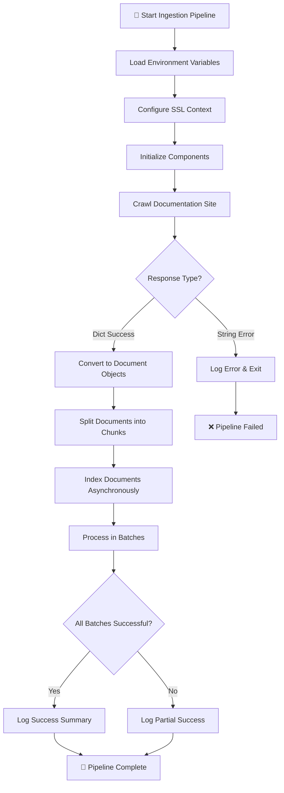

# LangChain Documentation Helper

## Setup with UV

This project uses [UV](https://github.com/astral-sh/uv) for dependency management.

### Installation

First, ensure you have UV installed. Then, to set up the project:

```bash
uv sync
```

This will create a virtual environment and install all dependencies.

### Running the project

Activate the virtual environment:

```bash
source .venv/bin/activate
```

Or use UV to run commands directly:

```bash
uv run python ingestion.py
```

## Ingestion Flow

The document ingestion pipeline follows a structured process to crawl, process, and index LangChain documentation. Below is the activity diagram and key code snippets for each step.

### Activity Diagram



### Key Components Initialization

```python
# Load environment variables
load_dotenv()

# Configure SSL Context to use certifi's certificates CA Bundle
ssl_context = ssl.create_default_context(cafile=certifi.where())
os.environ["SSL_CERT_FILE"] = certifi.where()
os.environ["REQUESTS_CA_BUNDLE"] = certifi.where()

# Initialize core components
embeddings = OpenAIEmbeddings(
    model="text-embedding-3-small",
    show_progress_bar=False,
    chunk_size=50,
    retry_min_seconds=10,
)

vectorstore = PineconeVectorStore(index_name="langchain-doc-index", embedding=embeddings)
tavily_crawl = TavilyCrawl()
```

### Documentation Crawling

```python
# Crawl the documentation site
res = tavily_crawl.invoke({
    "url": "https://python.langchain.com/",
    "max_depth": 2,
    "extract_depth": "advanced",
})

# Convert Tavily crawl results to LangChain Document Objects
all_docs = []
for tavily_crawl_result_item in res["results"]:
    all_docs.append(
        Document(
            page_content=tavily_crawl_result_item["raw_content"],
            metadata={"source": tavily_crawl_result_item["url"]},
        )
    )
```

### Document Chunking

```python
# Split document into Chunks
text_splitter = RecursiveCharacterTextSplitter(chunk_size=4000, chunk_overlap=200)
splitted_docs = text_splitter.split_documents(all_docs)
```

### Asynchronous Vector Indexing

```python
async def index_documents_async(documents: List[Document], batch_size: int = 50):
    """Process Documents in batches and Asynchronously."""
    
    # Create Batches
    batches = [
        documents[i : i + batch_size] for i in range(0, len(documents), batch_size)
    ]
    
    # Process all batches Concurrently
    async def add_batch(batch: List[Document], batch_num: int):
        try:
            await vectorstore.aadd_documents(batch)
            return True
        except Exception as e:
            log_error(f"VectorStore Indexing: Failed to add batch {batch_num} - {e}")
            return False
    
    # Process batches Concurrently
    tasks = [add_batch(batch, i + 1) for i, batch in enumerate(batches)]
    results = await asyncio.gather(*tasks, return_exceptions=True)
    
    # Count successful batches
    successful = sum(1 for result in results if isinstance(result, bool) and result)
    
    return successful, len(batches)
```

### Pipeline Execution

```python
async def main():
    """Main async function to orchestrate the entire process."""
    log_header("🚀 Starting LangChain Documentation Helper")
    
    # ... initialization code ...
    
    # Crawl and process documents
    res = tavily_crawl.invoke({
        "url": "https://python.langchain.com/",
        "max_depth": 2,
        "extract_depth": "advanced",
    })
    
    # Convert to documents and split
    all_docs = [Document(page_content=item["raw_content"], 
                        metadata={"source": item["url"]}) 
               for item in res["results"]]
    
    text_splitter = RecursiveCharacterTextSplitter(chunk_size=4000, chunk_overlap=200)
    splitted_docs = text_splitter.split_documents(all_docs)
    
    # Index asynchronously
    await index_documents_async(splitted_docs, batch_size=500)
    
    log_header("PIPELINE COMPLETE")
    log_success("🎉 All documents have been processed and indexed successfully!")
```
